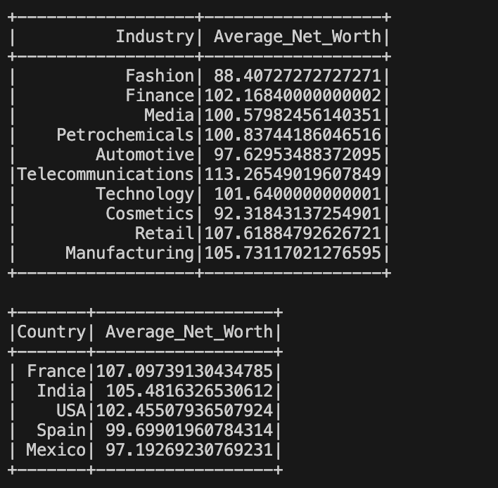

# IDS706 PySpark Data Processing

## Continuous Integration with GitHub Actions
[](https://github.com/Reby0217/ids706-miniProj10/actions/workflows/install.yml)
[](https://github.com/Reby0217/ids706-miniProj10/actions/workflows/lint.yml)
[](https://github.com/Reby0217/ids706-miniProj10/actions/workflows/format.yml)
[](https://github.com/Reby0217/ids706-miniProj10/actions/workflows/test.yml)
[](https://github.com/Reby0217/ids706-miniProj10/actions/workflows/report.yml)

This project demonstrates large-scale data processing using PySpark, focusing on extracting meaningful insights from a dataset of the top 1000 wealthiest people globally. The project meets the requirements for performing data processing with PySpark, applying both Spark SQL queries and data transformations, and utilizes GitHub Actions for Continuous Integration.

---


## Deliverables

- **PySpark Script**: A PySpark script (`src/cli.py`) that processes a comprehensive dataset of the world’s 1000 wealthiest individuals. Key operations include:
  - Data Processing and Transformation: Loads and processes the dataset, calculating the average net worth per industry to illustrate wealth distribution across various sectors.
  - Spark SQL Query: Identifies the top 5 countries by average net worth, highlighting geographical wealth concentration.
- **Summary Report**: An automatically generated Markdown report (`WealthData_Summary_Report.md`) that includes:
  - Average Net Worth by Industry: A summary of the average net worth across different industries.
  - Top 5 Countries by Average Net Worth: A breakdown of the top countries by average wealth, providing insights into wealth distribution by region.

---

## Setup Instructions

### Prerequisites

- **Python**: Version 3.9+
- **PySpark**: Installed via `requirements.txt`.


### Installation

1. **Clone the Repository**:
   ```bash
   git clone https://github.com/Reby0217/ids706-miniProj10.git
   cd ids706-miniProj10
   ```

2. **Set up the Virtual Environment**:
   ```bash
   make setup
   ```
   This command will create a virtual environment and prepare it for the project.

3. **Install Dependencies**:
   ```bash
   make install
   ```
   Installs all required dependencies listed in `requirements.txt` within the virtual environment.

4. **Run the Application and Generate the Report**:
   ```bash
   make run
   ```
   This command runs the PySpark script to process the dataset and generates the summary report `WealthData_Summary_Report.md` in the project root directory. The report includes:
   - **Average Net Worth by Industry**: Summary of net worth across various industries.
   - **Top 5 Countries by Average Net Worth**: Highlights wealth distribution by country.

  

### Makefile

The project uses a `Makefile` to streamline development tasks, including testing, formatting, linting, and installing dependencies. Key Makefile commands:

- **Test**: Runs tests for the notebook, script, and library.
  ```bash
  make test
  ```
  
- **Format**: Formats all Python files using `black`.
  ```bash
  make format
  ```

- **Lint**: Checks the code quality using `Ruff`.
  ```bash
  make lint
  ```

- **Install**: Installs all required dependencies from `requirements.txt`.
  ```bash
  make install
  ```

- **Generate Report**: Runs the CLI script to generate a Markdown report.
  ```bash
  make run
  ```

- **All**: Runs all major tasks (`install`, `setup`, `lint`, `test`, and `format`) in one command.
  ```bash
  make all
  ```