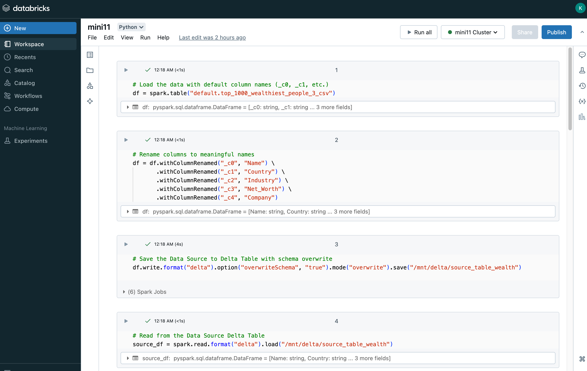
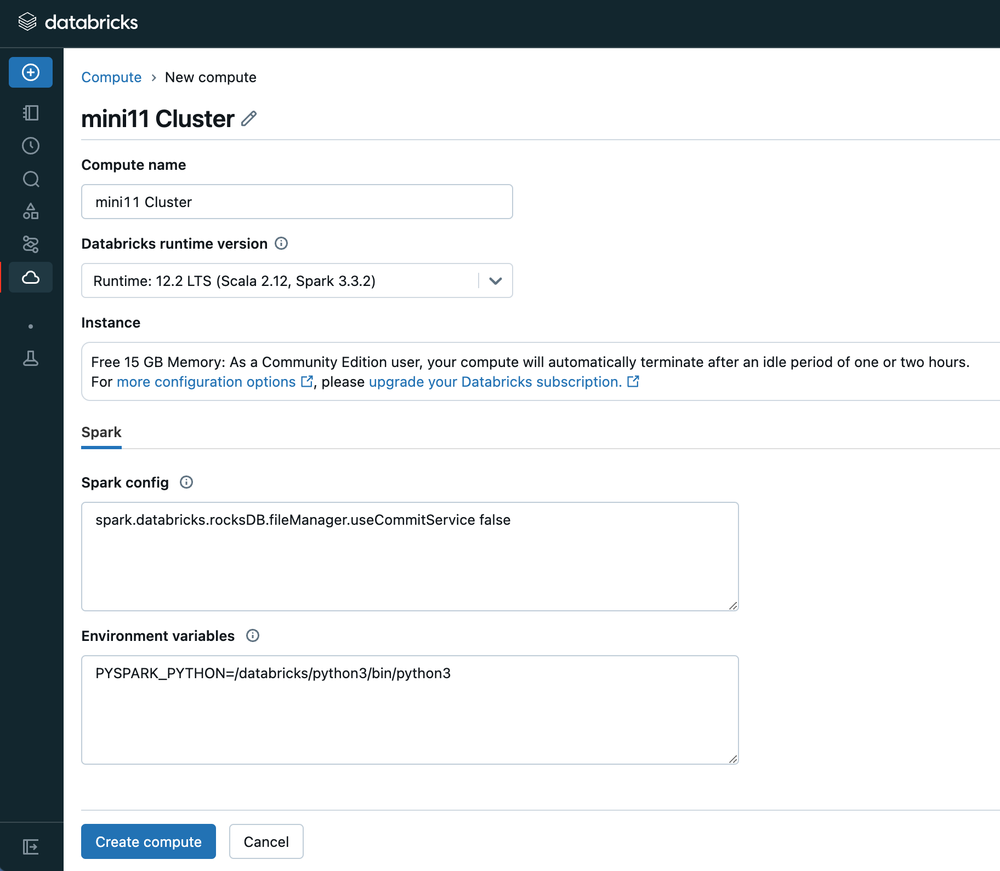
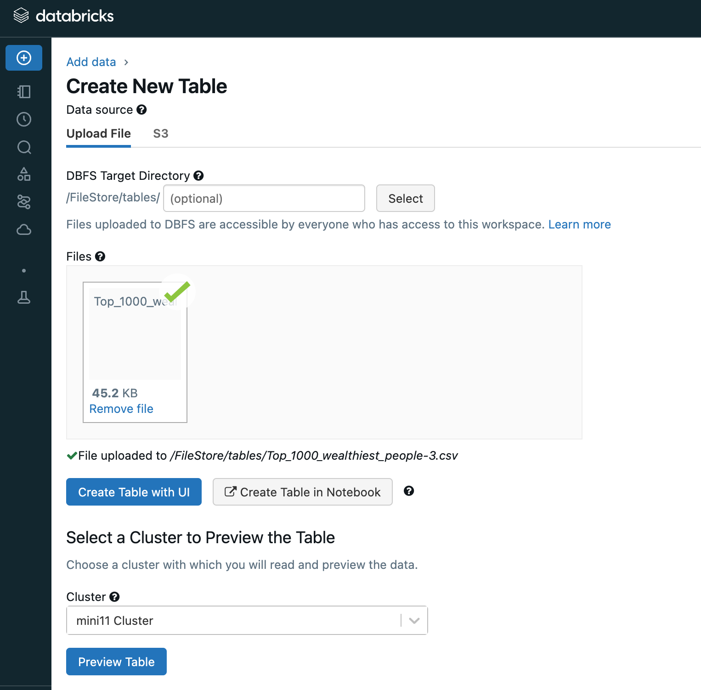
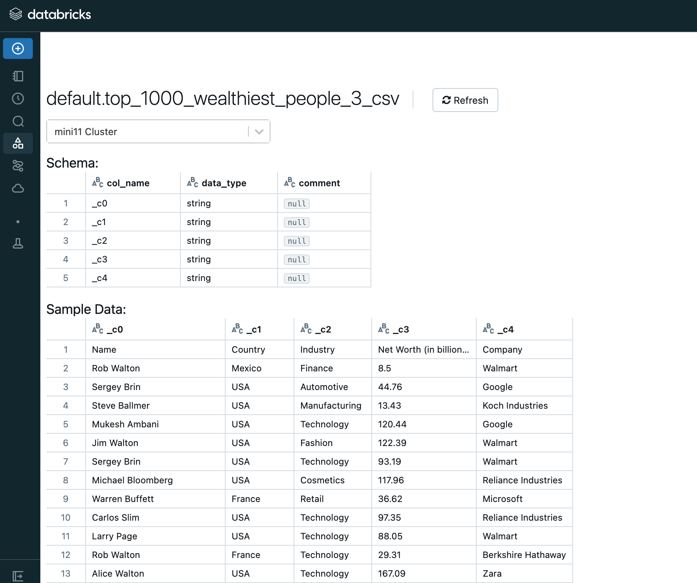
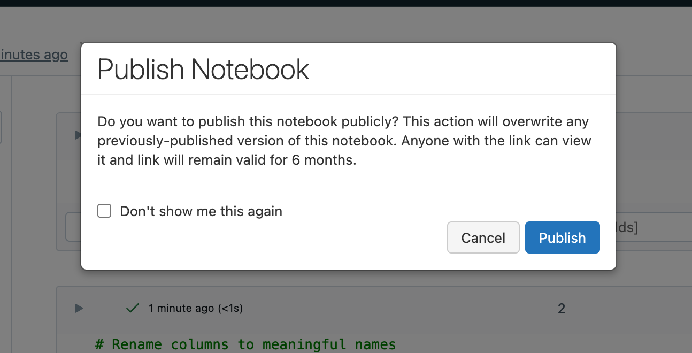
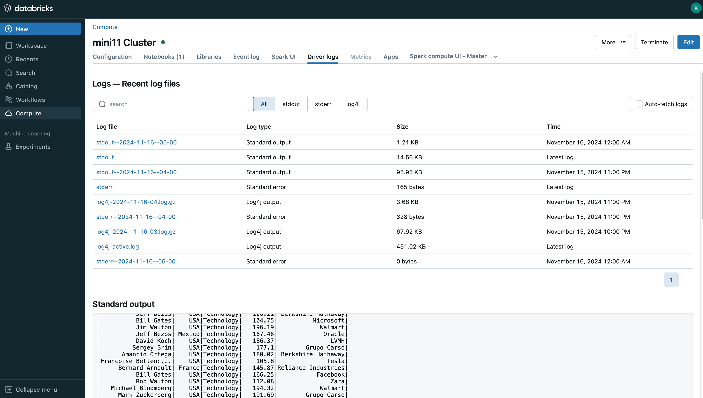

# IDS706 Data Pipeline with Databricks

## Continuous Integration with GitHub Actions
[](https://github.com/Reby0217/ids706-miniProj11/actions/workflows/install.yml)
[](https://github.com/Reby0217/ids706-miniProj11/actions/workflows/lint.yml)
[](https://github.com/Reby0217/ids706-miniProj11/actions/workflows/format.yml)
[](https://github.com/Reby0217/ids706-miniProj11/actions/workflows/test.yml)
[](https://github.com/Reby0217/ids706-miniProj11/actions/workflows/deploy.yml)

This project demonstrates a large-scale data pipeline using **Databricks** and **PySpark** to process and transform a dataset of the top 1000 wealthiest individuals. The pipeline includes a **data source** and a **data sink** configuration, a detailed PySpark script for data transformation, and a CI/CD pipeline using **GitHub Actions**. The `deploy` action automates the execution of the Databricks notebook `mini11` using the Databricks REST API, processing the wealth dataset on a specified cluster. 

---

## Deliverables

### **Databricks Notebook**
The notebook for the project is hosted on Databricks and can be accessed via the following link:

[Databricks Notebook - Mini11](https://databricks-prod-cloudfront.cloud.databricks.com/public/4027ec902e239c93eaaa8714f173bcfc/415132133840757/3302015049726372/7884501530959638/latest.html)

Here is a preview of the **notebook** interface:



---

## Databricks Configuration

### **Cluster Setup**
The project utilizes a Databricks cluster for execution. Below is the configuration of the cluster used in this pipeline:



### **Data Upload**
The `Top_1000_wealthiest_people.csv` dataset is uploaded to Databricks and configured as a Delta table for processing. Below is the interface for uploading and previewing the data:



---

## PySpark Data Pipeline

The data pipeline uses **PySpark** and **Spark SQL** to process a dataset of the top 1000 wealthiest individuals:

1. **Source Dataset**: 
   The dataset is initially loaded into a Delta table in Databricks. This table contains the following columns with default names: `_c0`, `_c1`, `_c2`, `_c3`, and `_c4`. These columns are renamed for better clarity:
   - `Name`
   - `Country`
   - `Industry`
   - `Net_Worth`
   - `Company`

   The source data is saved as a Delta table located at `/mnt/delta/source_table_wealth`.
   

2. **Data Transformation**:
   - The pipeline renames columns to meaningful names for better clarity and usability.
   - A **temporary SQL view** is created to allow the use of Spark SQL for transformations.
   - Using Spark SQL, the pipeline filters data to include only individuals in the `Technology` industry with a `Net_Worth > 100`. The query used:
     ```sql
     SELECT Name, Country, Industry, Net_Worth, Company
     FROM wealth_data
     WHERE Industry = 'Technology' AND Net_Worth > 100
     ```

3. **Sink Dataset**:
   - The transformed data is written to another Delta table located at `/mnt/delta/sink_table_wealth`, ensuring high-performance reads and writes. This data sink contains the filtered dataset after the SQL transformation.

---

### Publish the notebook


### Cluster log

